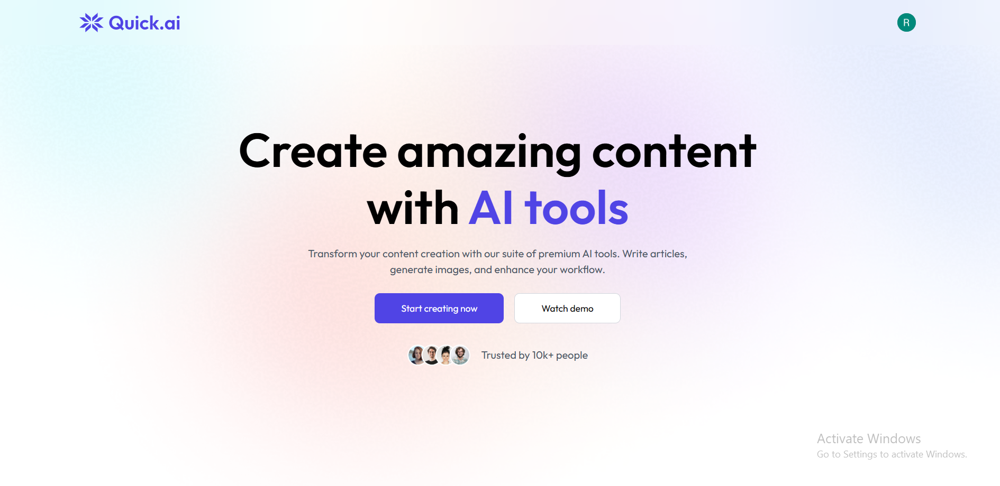
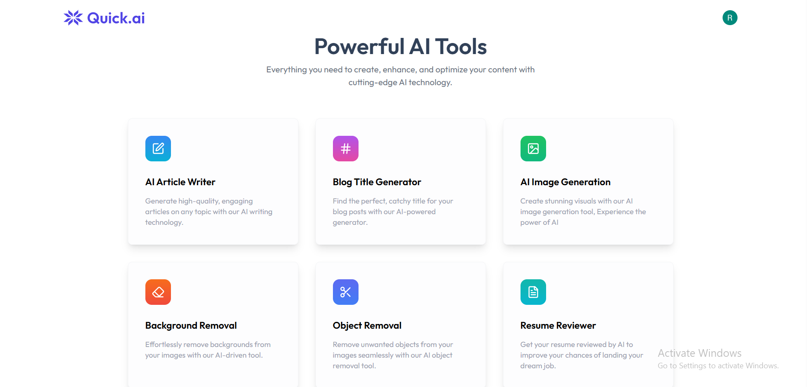
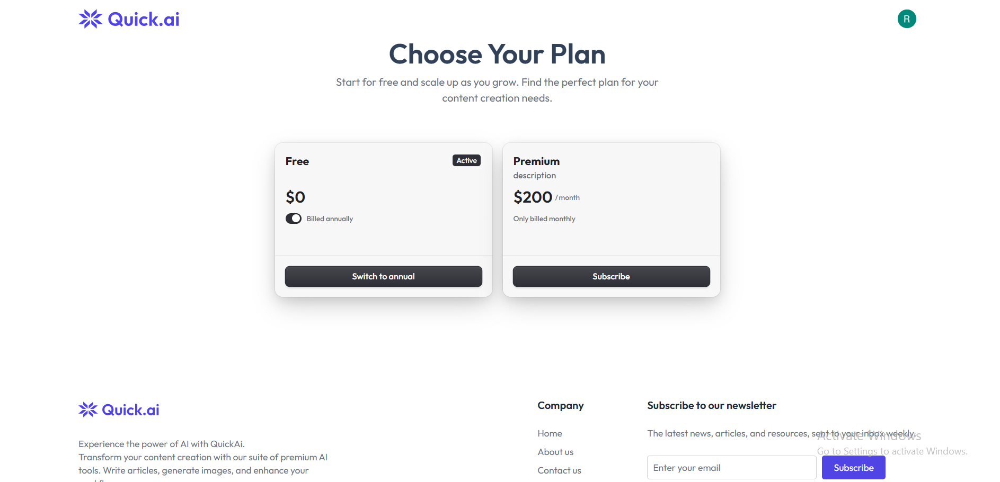
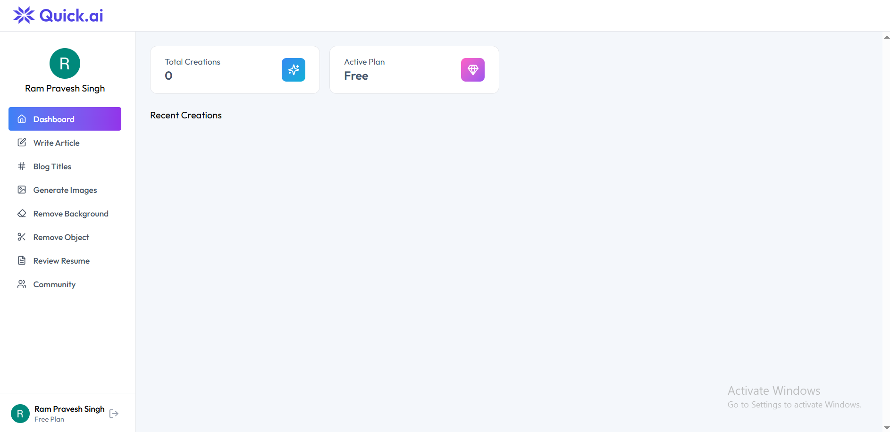
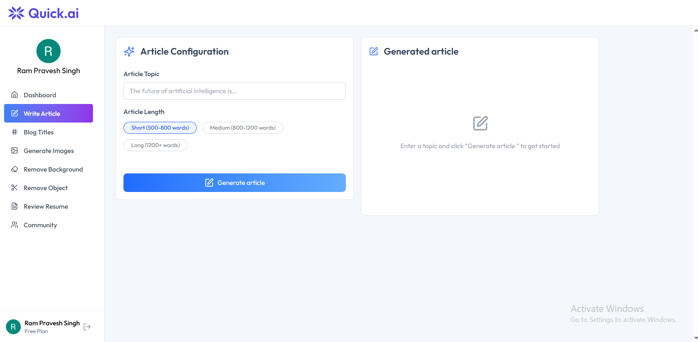
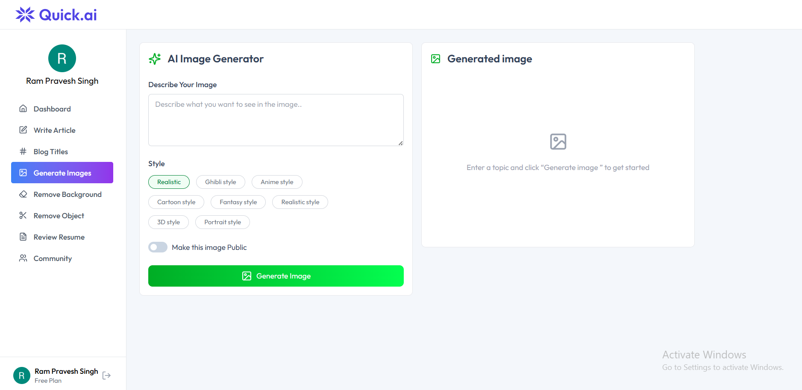
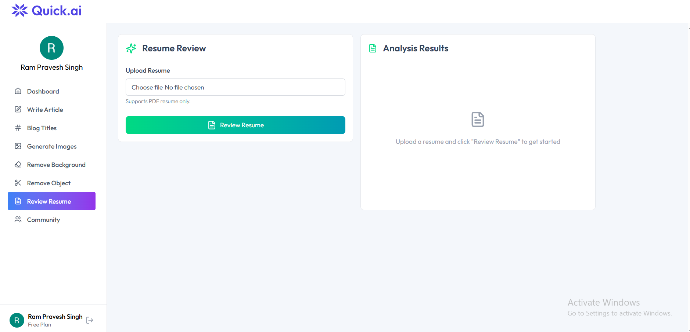
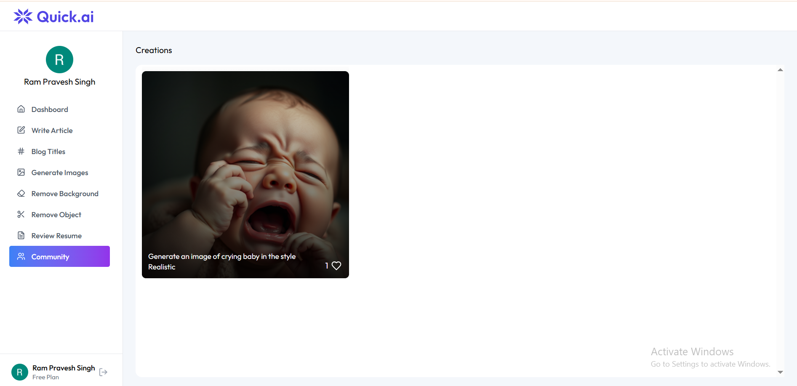

# 🤖 AI SaaS Platform

A full‑stack AI powered SaaS platform providing multiple AI tools
including article generation, image creation, and resume analysis with
subscription based access.

## 🌐 Live Demo

🚀 https://client-sass.vercel.app

## 🚀 Tech Stack

-   React.js
-   Node.js
-   Express.js
-   PostgreSQL (NeonDB)
-   Tailwind CSS
-   Clerk Authentication
-   Stripe Billing
-   Vercel

## 📸 Screenshots

### Homepage – Hero Section

### AI Tools Section

### Pricing Plans

### Dashboard

### Article Generator

### Image Generator

### Resume Analyzer

### Community Page

## ✨ Key Features

-   Secure authentication with Clerk
-   AI tools including:
    -   Article generator
    -   Blog title generator
    -   Image generator
    -   Resume analyzer
-   Subscription management with Stripe
-   Free and premium feature access
-   Public image community where users can explore AI generated images
-   Responsive UI with Tailwind CSS

------------------------------------------------------------------------

# ⚙️ Project Setup

## Prerequisites

Install Node.js and create a PostgreSQL database on NeonDB.

## Database Setup

Create table:

    CREATE TABLE creations (
    id SERIAL PRIMARY KEY,
    user_id TEXT NOT NULL,
    prompt TEXT NOT NULL,
    content TEXT NOT NULL,
    type TEXT NOT NULL,
    publish BOOLEAN DEFAULT FALSE,
    likes TEXT[] DEFAULT '{}',
    created_at TIMESTAMPTZ DEFAULT NOW(),
    updated_at TIMESTAMPTZ DEFAULT NOW()
    );

## Run Project

Install dependencies

    npm install

Run server

    npm run dev

## Author

Ram Pravesh Singh
